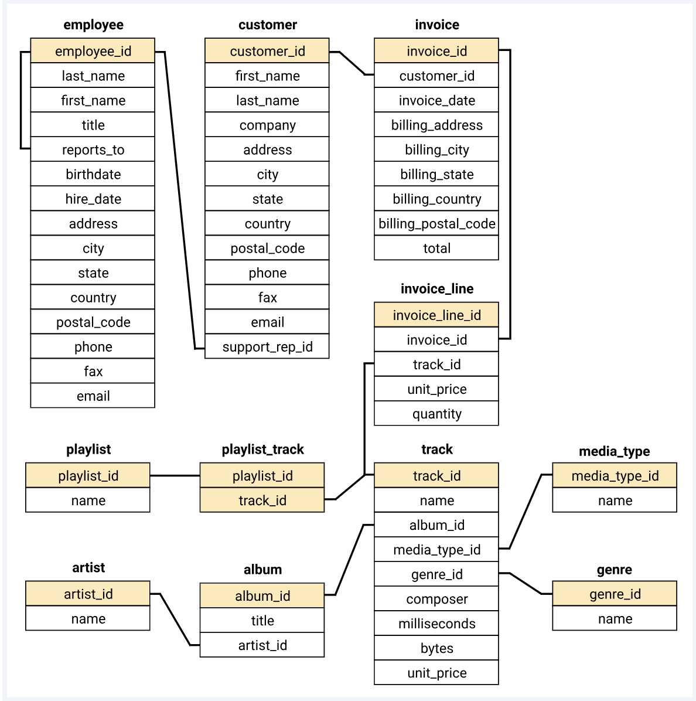

# SQL-music-store-analysis
## 📋 Overview
This project focuses on analyzing data from an online music store using SQL. The analysis is performed on a structured database to extract meaningful insights about the store's operations, sales, and customer behavior.
## 🛠️ Tools and Technologies
- **Database:** PostgreSQL
- **GUI Tool:** PgAdmin4
## 📊 Database Schema

